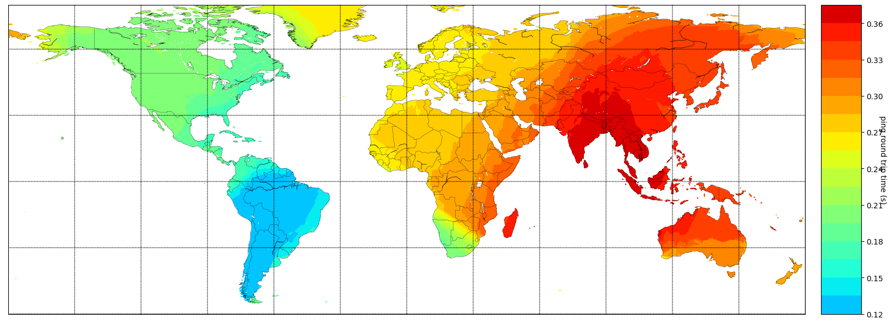
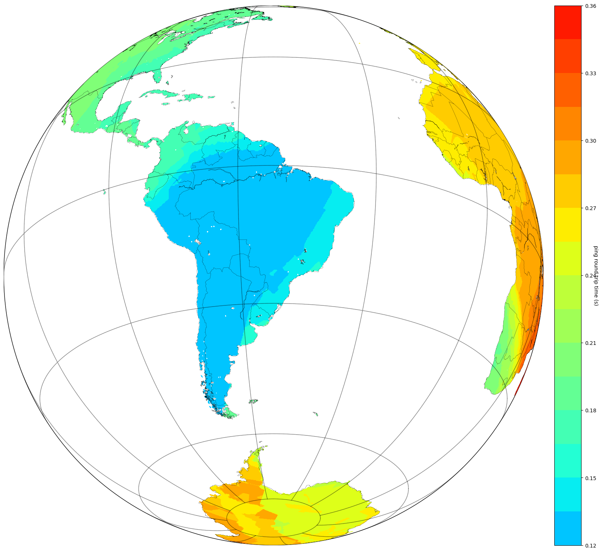
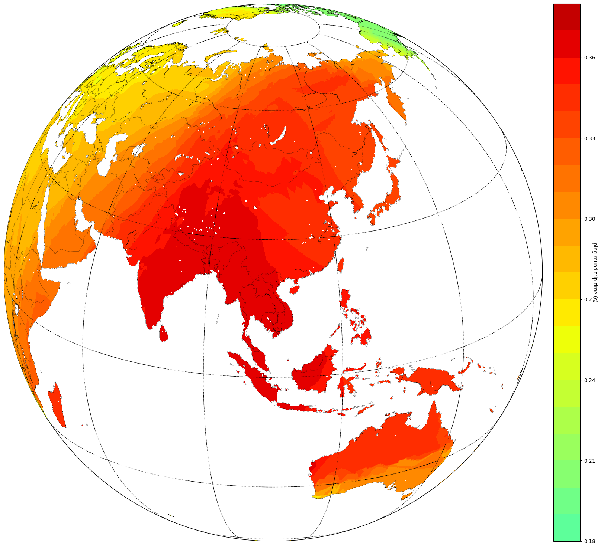

# Ping the world

Projeto Original do https://erikbern.com/2015/04/26/ping-the-world, a unica coisa que eu fiz foi fazer um `port` para o `python3` e atualizando alguns pacotes.


# Instalar Pacotes
```pip -r requirements.txt```

# Executar 

- Pegar os dados 
`python main.py`

- Fazer o gráfico
`python plot.py`

# Imagens






